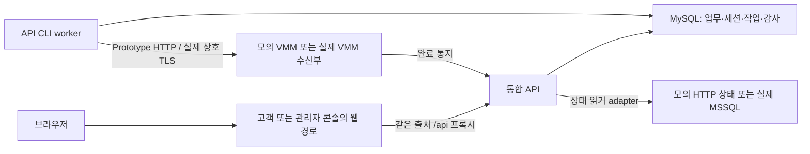

# 1차 구현 계획

> 2026-10-01 · 최초 작성은 구현 전 계획. 사용자 확정: VM 없는 지정 범위 무작위 VMM 모의 응답(D64), 사설망 상시 실습 운영(D63). 선정안·제안 수치를 실측값이나 사용자 승인값으로 표현하지 않는다. 이후 G0·P0~P4 로컬 실행 결과는 [검증 기록](operations/prototype-progress.md), 고정 버전은 [runtime manifest](../runtime-manifest.json)를 따른다.

작업 진입점: [AGENTS.md](../AGENTS.md) → [작업별 참조 문서](pmt-docs/README.md). 이 계획을 변경하면 해당 요약도 함께 갱신한다.

기능별 구현·확인 기준은 [기능목록](pmt-docs/feature-list.md)과 [기능 명세서](pmt-docs/function-specification.md)에 연결한다. 입출력은 각 값의 의미로 정의하고 Test·로그 기준은 해당 기능 ID를 사용한다.

인계 가능한 동작·변경 범위는 [기능별 구현 상세계획](pmt-docs/implementation-details/README.md), 병렬 작업의 소유·의존·통합은 [병렬 실행 계약](pmt-docs/implementation-details/parallel-execution.md)을 따른다. 파일별 편집 지시를 구현 목표로 삼지 않는다.

## 1. 요구사항과 가용 자원

| 요구사항 | 필요한 자원 | 현재 판정 |
| --- | --- | --- |
| VM 없이 신청·상태·실패 흐름 구현 | 개발 PC, PHP·Composer·MySQL, 웹/CLI 프로세스 | 프로젝트 내부 portable 도구와 분리 DB로 로컬 구현·검증. 전역 PATH 설치를 전제로 하지 않음 |
| 모의 VMM 무작위 응답 | HTTP 수신부, 지연 실행 프로세스, 모의 상태 저장소 | 실제 VMM·Windows Server·고객 VM 불필요. 개발 PC의 별도 프로세스로 구현 |
| 실제 고객 VM 제공 | 별도 64GB Windows 11 Pro PC, 중첩 Hyper-V, AD/DNS·VMM/SQL·Compute·Storage | 64GB·OS는 기존 사용자 확인. CPU·디스크·가용 용량·제품 사용 권한은 이번 사용자 답변에 따라 미확인 |
| Linux 이중화·지속 운영 | 물리 Hyper-V의 Linux 서비스 VM, 사설망, 인증서, 백업 저장소 | 역할·대수·배치 원칙만 확정. 실제 CPU/RAM/디스크 배정·네트워크·복구 매체 미확인 |

개발 PC와 실습 PC는 다른 장비다. 최초 계획 확인 시 D 드라이브 여유는 약 57.2GiB였다. 이후 개발 PC CPU·RAM·디스크 측정은 [검증 기록](operations/prototype-progress.md)에 있으며 실습 PC에 적용하지 않는다. Node 24.16.0·Python 3.13.13·Git 2.54.0은 실행 확인했다. Docker 엔진은 연결 실패였으므로 필수 실행환경으로 두지 않는다.

기존 구조 결정의 콘솔 VM 설정은 각 1 vCPU·1GiB RAM이다. Linux 8대 검증 중 콘솔 4대의 설정 합은 4 vCPU·4GiB이며 API·MySQL 자원과 실제 사용량은 미확인이다. 이는 설정 계획이지 가용 자원 실측이나 전체 64GB 배치의 통과 판정이 아니다. [기존 구조 검토표](../../docs/projects/architecture-review.md)를 근거로 유지한다.

**자원 게이트:**

- G0 개발 착수: PHP·확장·Composer·MySQL·로컬 웹 경로와 분리 테스트 DB를 확인한다. 이번 로컬 실행 증거는 검증 기록에 있다. 별도 실습 PC 준비를 의미하지 않는다.
- G1 실제 연동: 실습 PC CPU·중첩 가상화·디스크·자원표·라이선스, 네트워크, IIS 수신부 기술, MSSQL 조회 대상을 확인한다. 미확인 상태에서 실제 VM 구현 단계로 넘어가지 않는다.
- G2 상시 운영: 실측 자원 한도, 별도 백업 매체, 복구 시간, 운영 인증서·계정, 4+4 기동·감시를 검증한다.

Prototype 기본 실행은 개발 PC의 **네이티브 PHP·MySQL 프로세스**로 정한다. 컨테이너는 실행환경이 확인된 경우의 대안이며 필수 의존성으로 두지 않는다. VM은 생성하지 않는다. RAM·디스크 소모량은 G0에서 측정해 개발 한도를 정한다.

## 2. 프레임워크 선정과 기능 배정

| 구성 | 1차 선정 | 담당 기능·선정 이유 |
| --- | --- | --- |
| 고객 콘솔 | CodeIgniter 4의 Controller/View + Bootstrap 5.3 + 브라우저 JavaScript | 로그인 화면, VM 신청·목록·상세·작업 기록. PHP 방향을 유지하고 별도 SPA 프레임워크 없이 구현 |
| 관리자 콘솔 | 고객 콘솔과 같은 구성, 별도 앱 | 전체 작업·실패 조회. 이후 회원·사양·청구·인프라 관리. 공통 UI만 공유 |
| 통합 API | CodeIgniter 4 | 라우팅·검증·업무 규칙·DB 마이그레이션·외부 HTTP·CLI worker. 업무 기능은 API 내부 모듈로 분리 |
| 계정·인증 | 공식 CodeIgniter Shield | API의 세션 로그인, 회원·관리자 그룹/권한. 공개 가입과 Remember-me는 초기 비활성화 |
| 모의 VMM | 별도 CodeIgniter 4 앱 + CLI dispatcher | 요청 접수, 무작위 시나리오 결정, 상태 조회, 지연·누락·중복 완료 통지. 업무 API와 프로세스·DB 권한 분리 |
| 업무·세션·작업 DB | MySQL 8.4 LTS / InnoDB | 업무 원장, 공유 API 세션, 작업 큐·outbox·감사 기록. Prototype도 실제 MySQL 사용 |
| 실행환경 | PHP 8.4 + Composer 2 | CodeIgniter 공식 요구사항·PHP 지원 기간을 근거로 선정. intl·mbstring·mysqli·curl 등 실제 의존성 검사 |
| 웹·운영 | Nginx, Linux 배포 시 PHP-FPM·systemd·logrotate | 콘솔과 API의 같은 출처 경로, TLS, 프로세스 기동·로그 관리. Prototype의 PHP 내장 서버는 개발에만 사용 |
| 자동 검증 | CI4 테스트 도구 + 호환 PHPUnit | 상태 전이·권한·멱등·HTTP 계약·복구 시험. 정확한 PHPUnit 버전은 app starter 의존성과 함께 잠금 |

공식 근거: [CI4 요구사항](https://codeigniter.com/user_guide/intro/requirements.html), [PHP 지원 기간](https://www.php.net/supported-versions.php), [Shield](https://shield.codeigniter.com/), [Bootstrap 폼](https://getbootstrap.com/docs/5.3/forms/overview/), [MySQL LTS](https://dev.mysql.com/doc/refman/8.4/en/mysql-releases.html). 선정 이유는 이 프로젝트의 설계 판단이다.

CI4·Shield·Bootstrap·PHP·MySQL의 정확한 패치 버전은 G0에서 호환성을 검사해 `runtime-manifest.json`과 앱별 `composer.lock`에 고정한다. 외부 CDN 없이 Bootstrap 자산과 라이선스를 배포물에 포함한다. 초기에는 Redis·별도 메시지 브로커·Kubernetes·React를 추가하지 않는다. IIS 수신부 기술과 실제 MSSQL 드라이버는 기존 사용자 결정 절차에 따라 G1에서 선정한다.

## 3. 단계별 작업과 완료 기준

| 작업 | 범위 | 완료 증거 |
| --- | --- | --- |
| P0 환경·계약 | G0 확인, 의존성 잠금, API·상태·모의 설정 계약 | 실행환경 목록, 계약 파일, 설정 오류 시 기동 거부 |
| P1 골격·인증 | 세 앱과 모의 앱 골격, 초기 계정·API 세션·권한·CSRF, 계정 감사용 Audit append 기반 | 로그인·로그아웃, 권한 차단·계정 감사. 전체 업무 트랜잭션 감사는 P2에서 통합 |
| P2 신청·저장 | 고정 사양 1종, 신청·VM·작업·outbox·감사 기록 | 동일 키 재제출은 같은 작업 반환, 다른 본문은 409 |
| P3 모의 연동 | 무작위 추첨·상태 저장·dispatcher·콜백 inbox·조회 | 다섯 시나리오가 재현되고, 재시작 뒤 예정 통지가 복구됨 |
| P4 Prototype 마감 | 고객·관리자 화면 연결, 로그·지연 표시·시나리오 테스트 | 신청→접수→모의 결과→표시 일치. 실제 VM·VMM·MSSQL 없이 통과 |
| E0 환경·인프라 | G1, Compute 단독 시험, 인프라 8대·Linux 8대 별도 검증, 보존 축소 | 기존 8→4 결정과 자원·네트워크·이중화 증거. 두 8대 구성 동시 시험 없음 |
| E1 실제 연동 | 실제 VMM adapter·상호 TLS·MSSQL 조회·실제 회원 VM 생성·SSH | 인프라 4대+Linux 4대에서 콘솔·API·VMM·실제 VM 결과 일치 |
| E2 VM 기능 | 사양 목록·회원 관리, 시작·중지·재시작·삭제·사양 변경 | 소유권, 변경 조건, 중복·부분 실패·남은 디스크 복구 시험 |
| E3 청구 | 적용 사양 이력, 가상 단가 버전·기간 원장, 월별 청구 | 월 경계·삭제·사양 변경과 중복 발행 방지 검증 |
| E4 운영 기능 | 별도 MariaDB/Galera·접근 경로·VPC 관리자 제어, Slack·제한 이메일 | 장애·재합류·분리·연결 증거, SMS·테스트 PG 조건부 결정 |
| R1 배포·보안 | 4+4 서비스, systemd·HTTPS·비밀정보·인증서 갱신·모의 모드 차단 | 재부팅 후 가동 대수 유지, 운영 설정·권한·인증서 검증 |
| R2 복구·감시 | 백업·복원, 감시·경보·로그 회전, 배포·롤백 | 실제 DB·VM 복원, 실패/누락 작업 복구, 배포·인증서 갱신 시험 |
| R3 Production 마감 | 자원·부하·운영 한도, 복구 절차·증거 정리 | G2 충족과 아래 운영 합격표 통과 |

E0에서 인프라·Linux 시험의 선후는 자원 확인 뒤 정한다. Galera 실습 노드는 MySQL 서비스 8대와 별개이며 배치를 먼저 정한다. Node 비교 구현은 별도 작업이다. 기본 보안·감사·복구 수단은 P/E부터 포함하고 R에서 반복 운영을 검증한다.

## 4. 폴더 tree

아래는 생성 예정 구조다. 이번 요청에서는 계획 문서만 생성한다.

```text
cloud-management-portal-lab/
├─ apps/
│  ├─ customer-console/          # CI4 고객 앱
│  │  ├─ app/{Config,Controllers,Views}/
│  │  ├─ public/assets/{css,js}/
│  │  ├─ tests/
│  │  └─ composer.json, composer.lock, spark
│  ├─ admin-console/             # 같은 골격, 관리자 화면만
│  ├─ api/
│  │  ├─ app/
│  │  │  ├─ Config/              # 명시적 routes, 서비스 조립, 환경 설정
│  │  │  ├─ Filters/             # 로그인·역할·CSRF·요청 ID
│  │  │  ├─ Commands/            # 작업·outbox·재조회 CLI
│  │  │  ├─ Database/{Migrations,Seeds}/
│  │  │  ├─ Modules/
│  │  │  │  ├─ Identity/
│  │  │  │  ├─ Vm/
│  │  │  │  ├─ Jobs/
│  │  │  │  ├─ Audit/
│  │  │  │  └─ Integrations/{SimulatedVmm,RealVmm,SqlStatus}/
│  │  │  └─ Shared/{Clock,Identifiers,Logging,Contracts}/
│  │  ├─ public/
│  │  ├─ tests/{Unit,Feature,Integration,Contract}/
│  │  └─ composer.json, composer.lock, spark
│  └─ vmm-simulator/
│     ├─ app/{Config,Controllers,Commands,Models,Services,Database}/
│     ├─ public/
│     ├─ tests/
│     └─ composer.json, composer.lock, spark
├─ packages/ui/                 # 공통 UI: 템플릿·자산·문구
├─ contracts/{api-v1.yaml,vmm-v1.yaml,simulation-profile.schema.json}/
├─ fixtures/simulator/{profiles,reference-flows}/
├─ config/examples/             # 값 없는 환경·로그·시뮬레이터 설정 예
├─ deploy/{local,linux}/        # 웹 경로·서비스·로그 회전·릴리스 템플릿
├─ tools/                       # 계약·환경·안전한 증거 점검
├─ docs/{implementation-scope.md,implementation-plan-v1.md,pmt-docs/,operations/}/
├─ AGENTS.md                    # 작업 지침·참조 문서 진입점
├─ .runtime/                    # 개발 writable·로그·pid, Git 제외
└─ runtime-manifest.json        # 제품·확장·정확한 버전·잠금파일 체크섬
```

Prototype은 Identity·Vm·Jobs·Audit·모의 Integrations만 구현한다. Billing·Infrastructure·Notifications는 E 단계에서 `Modules/`에 추가하며 빈 서비스 골격을 미리 만들지 않는다. RealVmm·SqlStatus도 P에서 동작 코드를 만들지 않고 인터페이스만 정의한다.

## 5. 모듈 분리와 책임

API 업무 모듈은 `Http/`(입출력), `Application/`(사용 사례), `Domain/`(규칙·상태·인터페이스), `Persistence/`(MySQL 구현)로 나눈다. 단순 모듈에는 필요한 폴더만 만든다. PSR-4 namespace를 명시적으로 등록한다. [CI4 모듈 공식 안내](https://codeigniter.com/user_guide/general/modules.html).

| 모듈 | 소유 기능·데이터 | 다른 모듈과의 경계 |
| --- | --- | --- |
| 고객·관리자 콘솔 | 화면 템플릿·API 호출·상태 표시·입력 안내 | 업무 DB 접근 없음. 브라우저는 콘솔의 `/api/` 경유로 API 사용. 서버 API가 모든 권한을 판정 |
| Identity | Shield 계정·그룹·권한·API 세션 | 사용자 ID와 권한 제공. VM 소유권은 Vm이 판정 |
| Vm | 소유자·사양·논리 VM ID·외부 VM ID·조회 상태 | 생성 요청 검증 후 Jobs 사용 사례 호출. 사양·실제 전원·게스트 상태를 작업 상태와 분리 |
| Jobs | 작업·시도·상태 전이·outbox·callback inbox | 외부 요청·결과 수신 조정. Vm의 적용 상태 갱신은 Vm 사용 사례로 호출 |
| Integrations | `VmCommandGateway`, `VmStatusReader`, `CompletionReceiver` | 모의 HTTP 또는 실제 HTTPS/MSSQL에 대한 변환. 업무 규칙·권한·청구 계산 없음 |
| Audit | 행위자·대상·허용/거부·상태 변경 기록 | 상태 변경 트랜잭션에 기록 포함. 기술 로그와 분리 |
| VMM simulator | 모의 작업·VM 상태·추첨 결과·예정 통지 | 별도 DB/schema·계정, API 업무 테이블 직접 수정 금지 |
| Billing (E3) | 실제 적용 사양 구간·단가·청구서 | Vm 변경 확정 이벤트 사용. 외부 조회값을 바로 금액으로 변환하지 않음 |
| Infrastructure (E4) | Linux 관찰·허용 제어·결과 기록 | 별도 executor 계약. VMM adapter에 Linux 제어를 섞지 않음 |
| Notifications (E4) | Slack·제한 이메일·발송 시도 | outbox 이벤트 소비. 알림 실패가 VM 성공 상태를 되돌리지 않음 |

단일 API 배포물 안의 모듈은 PHP 메서드·DTO로 통신한다. 모듈 간 HTTP와 임의 전역 이벤트 버스는 만들지 않는다. 확실한 비동기 실행이 필요한 외부 통신·알림만 DB outbox를 사용한다.

## 6. 통신·인증·데이터 계약



콘솔 CI4는 화면 골격만 제공하고, 업무 데이터는 JavaScript가 API에서 받아 표시한다. 고객·관리자 콘솔의 웹 서버는 `/api/`를 API로 프록시한다. API에만 Shield·MySQL 계정을 배치한다. API 노드 간 세션은 MySQL DatabaseHandler로 공유한다. [공식 세션 저장소](https://codeigniter.com/user_guide/libraries/sessions.html).

- 고객·관리자 콘솔은 서로 다른 등록 호스트명과 host-only 세션 쿠키를 사용한다. Prototype에서는 로컬 이름·loopback만 쓰고, 실습에서는 등록한 사설 DNS 이름을 사용한다. 브라우저 쿠키 Domain을 넓게 공유하지 않는다.
- API는 JSON 로그인·로그아웃·현재 사용자·CSRF 초기화 엔드포인트를 제공한다. Shield session authenticator, 로그인 후 세션 재발급, 세션 CSRF를 사용한다. 인증 실패는 JSON 401, 권한 부족은 403, 숨겨야 할 타인 객체는 404로 통일한다.
- 프록시는 Host·scheme·요청 ID를 정해진 규칙으로 전달한다. API는 등록된 프록시만 신뢰하며 클라이언트가 임의 인증 헤더를 보내 신원을 바꿀 수 없게 한다.
- 실제 배포의 브라우저·콘솔→API는 검증된 HTTPS, API↔VMM은 기존 결정의 상호 TLS·출발지 제한이다. Prototype의 모의 HTTP 예외는 loopback 개발 모드에만 허용한다. 실제 MSSQL은 CA 검증 TLS·읽기 전용 최소 객체 권한이다.
- SQL 조회 대상 DB와 IIS 수신부 구현은 미정이다. 모의 상태를 HTTP로 읽는 것은 실제 MSSQL 계약을 자동 변경하지 않는다.

| 엔드포인트 초안 | 기능 |
| --- | --- |
| `POST /api/v1/auth/login`, `POST /auth/logout`, `GET /auth/me`, `GET /auth/csrf` | 전체 경로는 `/api/v1` 기준. 로그인·세션·CSRF |
| `POST /api/v1/vms`, `GET /vms`, `GET /vms/{id}` | 고정 `profile_id` 신청, 소유 범위 조회 |
| `GET /api/v1/jobs/{id}` | 작업 단계·최종 조회 시각·오류 코드·모의 여부 |
| `POST /internal/v1/vmm-completions` | VMM 서비스 전용 완료 통지. 사용자 세션 경로와 분리 |
| 모의 `POST /vmm/v1/jobs`, `GET /vmm/v1/jobs/{id}` | 접수·지속 상태 조회. 모의 실행환경에서만 제공 |

신청 헤더 `Idempotency-Key`와 본문 해시를 `(사용자, 작업종류, 키)` 고유 제약에 연결한다. 동일 키·동일 본문은 기존 작업, 다른 본문은 409다. 응답은 `202`와 `job_id`, `vm_id`, `status`, `mode`, `request_id`다. 서버가 VM ID·이름을 만들고 브라우저가 명령·경로·스위치 이름을 지정하지 못한다.

완료 메시지는 `event_id`, `job_id`, `external_job_id`, `external_vm_id`, `attempt`, `status`, `observed_at`, `error_code`, `mode`를 포함한다. 요청·대상·시도 번호와 대조하고 `event_id` 고유 제약으로 중복 반영을 막는다. 이전 시도 결과나 이미 확정된 결과와 충돌하면 격리·감사 기록하고 상태를 덮어쓰지 않는다. JSON schema와 정상/오류 예를 contracts에 고정한다.

완료 통지가 외부 작업 ID 저장보다 먼저 도착하면 inbox에서 보류한 뒤 매핑 저장 후 검증한다. 통지 인증·schema 검증 실패는 거부하고, 업무 반영은 inbox 처리 트랜잭션으로 수행한다. 통지 처리 완료 전에 수신부가 중단돼도 재처리할 수 있게 한다.

업무 DB 최소 테이블은 Shield 테이블·`ci_sessions`, `vm_profiles`, `vms`, `jobs`, `job_attempts`, `outbox`, `callback_inbox`, `audit_events`다. 모의 DB는 `sim_jobs`, `sim_vms`, `sim_deliveries`다. P에는 청구 테이블을 만들지 않는다. UTC 시각·불변 ID·외래키·고유 제약을 사용하고 화면·청구 월 경계는 Asia/Seoul로 변환한다.

## 7. 무작위 VMM 모의 응답 규칙

사용자 확정은 **지정 범위 내 무작위 응답·VM 없음**이다. 다음 숫자는 실행 가능한 기본 제안이며 설정 파일로 변경한다.

| 시나리오 | 제안 가중치 | 동작 |
| --- | --- | --- |
| 정상 성공 | 70 | 2~15초 뒤 모의 상태 성공 및 완료 통지 |
| 실행 실패 | 15 | 2~15초 뒤 허용 오류 코드 중 하나와 실패 통지 |
| 늦은 완료 | 5 | 30~60초 뒤 성공 통지. API 대기 기준 20초 초과 경로 검증 |
| 완료 통지 누락 | 5 | 모의 상태는 2~15초 뒤 성공, 최초 통지는 보내지 않음 |
| 중복 완료 통지 | 5 | 2~15초 뒤 성공, 같은 event_id의 통지를 1~3초 뒤 한 번 재전송 |

유효 요청의 접수 응답은 202로 고정하고 실행 결과를 추첨한다. 잘못된 입력·신원·중복 본문 충돌은 정상 규칙대로 4xx 처리하며 무작위로 권한 검사를 통과시키지 않는다. 최초 범위는 생성 작업·고정 사양 1종이다. CPU·RAM·디스크 값은 모의 profile 값이며 호스트 자원을 예약하지 않는다. 실제 사양 수치는 G1에서 정한다.

- 설정에 `profile_version`, `seed`, 정수 가중치, 지연 최소/최대, 오류 allowlist, 중복 횟수·간격, 최대 대기 작업 수를 둔다. 가중치 합 100, 음수 없음, min≤max, 상한 준수 여부를 기동 때 검사한다. 오류 기본값은 `SIM_IMAGE_UNAVAILABLE`, `SIM_STORAGE_FULL`, `SIM_EXECUTION_FAILED`다.
- 모의 수신부는 요청별 한 번만 시나리오를 추첨하고 입력·seed·프로필 버전·추첨 결과·due_at을 저장한다. 중복 요청·조회·프로세스 재시작으로 다시 추첨하지 않는다.
- 기본은 무작위다. 자동 검증에서는 고정 seed와 시나리오 강제 지정으로 모든 분기를 재현한다. 강제 지정은 개발 CLI에만 허용한다. 알고리즘·버전도 기록하고 저장된 추첨 결과를 재현 기준으로 사용한다.
- 지연은 HTTP 처리 중 sleep하지 않고 DB 예정 통지와 CLI dispatcher로 처리한다. 예제 계획은 최대 대기 100건, dispatcher 1개다. 자원 시험 후 조정한다.
- callback 누락 상태에서는 조회값·조회 시각을 표시하되 자동으로 성공 확정하지 않는다. `reconciliation_required`로 남기고 모의 dispatcher 재통지 등 명시적 복구를 수행한다. 실제 복구 정책은 E1에서 사용자에게 결과를 설명한 뒤 확정한다.
- 모든 모의 데이터·화면·로그에 `mode=simulated`를 붙인다. 모의 응답의 SSH 정보는 접속 가능한 주소로 표현하지 않는다. Production 기동은 모의 adapter/개발 강제 설정을 거부한다.

## 8. 모듈 동작 레퍼런스

**정상 생성:** 브라우저 로그인·CSRF 준비 → Vm 입력/소유권 검사 → Jobs·Vm·outbox·Audit를 한 DB 트랜잭션으로 저장 → 202 → worker가 outbox를 점유 → 모의 VMM 접수 → 외부 작업 ID 저장 → dispatcher 완료 통지 → inbox 저장·검증 → Jobs 확정·Vm 반영·Audit 기록 → 화면 GET으로 결과 확인.

**작업 상태:** `queued → dispatching → running → succeeded/failed`. 전달 응답 유실·기한 초과·통지 누락은 `reconciliation_required`다. 이를 실행 실패와 구분한다. 유효한 늦은 완료는 검증 후 상태를 확정할 수 있다. 종료 결과와 VM 전원·게스트 상태는 별도 필드다.

**작업자 중단:** 큐 row의 lease/만료 시각을 기록하고 재기동 시 회수한다. 외부 접수 여부가 불명확한 요청은 동일 외부 멱등 키로 조회·재접수한다. 실제 VMM 수신부의 멱등 계약 없이는 새 VM 생성 명령을 맹목 재시도하지 않는다. DB 잠금은 점유·저장 동안만 유지하고 네트워크 호출 중 유지하지 않는다. 큐 점유에는 InnoDB 트랜잭션과 `FOR UPDATE SKIP LOCKED`를 사용한다. [MySQL 공식 SELECT 안내](https://dev.mysql.com/doc/refman/8.4/en/select.html).

**페이지 조회:** API는 StatusReader로 모의 HTTP/실제 MSSQL 상태를 조회하고 관찰값을 별도 저장·표시한다. 외부 조회 실패는 마지막 값과 오래된 상태를 표시한다. 조회값과 callback이 충돌하면 확정 결과를 임의 덮어쓰지 않고 재확인 대상으로 기록한다. 세션 잠금은 인증·CSRF 처리 후 가능한 빨리 해제해 긴 외부 조회가 같은 사용자의 다른 요청을 막지 않게 한다.

`fixtures/simulator/reference-flows/`에 success·failure·late·missing·duplicate별 요청, 202 응답, 조회값, callback, 기대 DB 상태와 타임라인을 JSON으로 작성한다. 모의 서버와 API가 같은 내부 구현을 공유해 테스트를 자기 검증하지 않도록, 계약 fixture를 독립 기준으로 사용한다.

정상 생성 계약 예시(식별자는 예시이며 실제 서버가 생성):

```json
{
  "request": {"profile_id": "sim-basic-1"},
  "accepted": {
    "job_id": "job-example-1", "vm_id": "vm-example-1",
    "status": "queued", "mode": "simulated", "request_id": "req-example-1"
  },
  "completion": {
    "event_id": "event-example-1", "job_id": "job-example-1",
    "external_job_id": "sim-job-1", "external_vm_id": "sim-vm-1",
    "attempt": 1, "status": "succeeded",
    "observed_at": "2026-10-01T00:00:10Z", "error_code": null,
    "mode": "simulated"
  }
}
```

이 예의 `request`는 신청 본문, `accepted`는 API의 202 본문, `completion`은 별도 callback 본문이다. 실패는 같은 식별자를 유지하며 `status=failed`와 허용 오류 코드를 사용한다. 누락은 callback 본문 자체가 없고, 중복은 동일 event_id의 callback이 재전송된다.

## 9. 기능 확장을 위한 여지

- 모의→실제 전환은 설정에서 Gateway·StatusReader 구현을 조립한다. Controller·Vm·Jobs·권한 규칙은 유지한다. 외부 프로토콜 차이는 adapter 안에 둔다.
- 모의 DB·실제 DB·인증서·작업 ID namespace는 분리한다. 모의 VM 행을 실제 adapter에 넘기거나 모의 상태를 실제 자원으로 이관하지 않는다.
- 새 VM 동작은 operation allowlist·정책·입력 DTO·상태 전이·adapter·계약 시험을 함께 추가한다. 사양 변경은 실제 적용 확인 뒤 이력 이벤트를 만든다.
- Billing과 Notifications는 확정 이벤트/outbox에서 확장한다. 금액은 Decimal·단가 버전·구간 원장으로 계산한다. Infrastructure는 별도 제어 인터페이스를 둔다.
- API 2대 시험 시 MySQL 세션·큐·멱등 제약을 공유한다. 같은 코드의 배포 역할·설정만 달리한다. MySQL 2대 복제·전환 방식은 E0 전에 별도 결정한다.
- 예약된 빈 프레임워크나 범용 plugin engine은 만들지 않는다. 실제 기능 추가 때 해당 모듈과 migration을 추가한다.

## 10. 코드 구현 규칙

1. 명시적 routes·입력 DTO·응답 schema를 사용한다. Controller는 HTTP 변환만, Application은 사용 사례, Domain은 규칙, adapter는 외부 변환만 담당한다.
2. PHP strict types·PSR-4·PSR-12, 명확한 반환 타입을 사용한다. framework/vendor 수정과 전역 공유 상태를 금지한다. [CI4 PSR 준수](https://codeigniter.com/user_guide/intro/psr.html).
3. SQL은 Query Builder/바인딩, 변경은 migration으로 관리한다. 생성·청구·callback의 고유 제약을 DB에도 둔다. 트랜잭션 실패 여부를 명시적으로 검사한다.
4. 인증·소유권은 서버에서 매 요청 검사한다. 회원에게 외부 VM ID·경로·명령을 입력받지 않는다. 출력 escaping과 allowlist 검증을 적용한다.
5. 시간·ID·무작위 생성기를 주입해 재현 가능하게 한다. 테스트를 위해 운영 규칙을 바꾸지 않는다. 브라우저 시간은 청구·완료 판정 기준이 아니다.
6. 외부 연결에 timeout·응답 크기 한도·schema 검사·TLS 검증을 둔다. 키·비밀번호·쿠키·내부 주소는 공개 코드/증거에 넣지 않는다.
7. 요청 재전송과 작업 재시도를 구분한다. 동일 멱등 키는 같은 작업이며, 명시적 재시도는 새 attempt와 이력을 만든다.
8. 환경 변수는 구성 경계에서 읽고 타입 검증한다. `.env.example`에는 빈 값·설명만 둔다. 운영 비밀은 웹 루트·Git 밖 서비스 계정 전용 파일에 보관한다.
9. 상태별 오류 코드를 고정하고 사용자 메시지와 기술 상세를 분리한다. 숨겨진 성공 처리·예외 삼키기·무제한 retry를 금지한다.
10. 테스트는 소유권 우회·중복·누락·늦은 결과·worker 중단·실제 연동 계약을 검증한다. 단순 화면 변경마다 구현을 그대로 복제하는 테스트는 추가하지 않는다.

## 11. 운영 로깅 저장·관리

| 기록 | 저장 위치·내용 | 제안 보존·관리 |
| --- | --- | --- |
| API·worker·모의 앱 기술 로그 | 개발 `.runtime/<service>/logs/`, 운영 `/var/log/cloud-portal/<service>/`의 JSON Lines | Prototype 14일·서비스당 총 200MiB, Production 30일·서비스당 총 1GiB. 일별/20MiB 회전·압축, 오래된 기술 로그부터 제거 |
| Nginx 접근·오류 | 같은 운영 로그 디렉터리의 별도 파일 | 30일·서비스당 총 1GiB 제안. 쿠키·Authorization·본문·query string 제외 |
| 감사 원장 | MySQL `audit_events`: 행위자·대상·작업·허용/거부·상태 변경·시각 | Production 180일 제안. 앱 계정은 추가/조회만, 정리는 별도 관리 계정·archive 절차 |
| 작업·통지·청구 원장 | MySQL jobs/attempts/inbox 및 E3 청구 테이블 | 작업 180일, 가상 청구 24개월 제안. 활성/재확인 작업은 기간만으로 삭제하지 않음 |
| 검증 증거 | 민감정보 제거 후 `docs/operations/`와 fixture | 실제 값·오류 재현·검증 한계만 보관. 원본 운영 로그의 Git 업로드 금지 |

숫자는 실습 보존 정책 제안이며 법적 의무나 실측 용량이 아니다. DB 원장·archive의 용량 예산은 G1/G2에서 정한다. 원장 용량 부족은 경보·작업 접수 제한으로 대응하고 감사·청구를 조용히 유실시키지 않는다.

로그 공통 필드는 `timestamp_utc`, `level`, `service`, `release`, `mode`, `request_id`, `job_id`, `attempt`, `event`, `duration_ms`, `error_code`다. 요청 ID는 수신부에서 생성/검증한다. 사용자 ID는 필요한 감사 기록에만 남긴다. 비밀번호·세션·토큰·인증서 개인키·전체 요청 본문·내부 접속 주소는 로그 제외/마스킹한다.

CI4의 PSR-3 경계에 JSON handler를 구현하고 오류·상태 변경은 INFO/WARN/ERROR로 기록한다. DEBUG는 운영 기본 비활성화다. [Nginx 로그 공식 안내](https://nginx.org/en/docs/http/ngx_http_log_module.html)를 바탕으로 필드를 제한한다. Linux logrotate는 회전 후 파일 재열기를 검증하고 서비스 계정 쓰기·운영자 읽기 권한만 둔다.

Production의 서비스 상태·worker heartbeat·최장 대기 시간·오류율·디스크·DB 백업 시각·인증서 만료를 감시한다. 경보는 E4에서 만든 Slack/이메일 경로를 사용하며 중복을 억제한다. Prototype에서는 관리자 작업 화면·기술 로그로 확인하고 외부 알림은 연결하지 않는다.

## 12. 운영 합격 기준과 보류 항목

| 합격 항목 | 1차 목표 |
| --- | --- |
| 백업·복원 | MySQL·설정·고객 VM/VHDX를 별도 매체에 보관하고 일관된 복원 시험. 제안 RPO 24시간·RTO 4시간, 실제 측정 후 확정 |
| 배포·롤백 | 잠금된 의존성의 릴리스 디렉터리·health check·이전 코드 전환. DB는 호환 migration 우선, 파괴적 변경은 복원 절차 없으면 배포하지 않음 |
| 재부팅 | AD/DNS→Storage·관리→Compute 및 Linux DB→API→콘솔의 의존 조건 확인. 추가 VM 자동 시작 제한과 4+4 가동 상태 확인 |
| 서비스 장애 | 종료된 worker·누락 callback·DB 연결 실패·로그 용량 초과를 탐지하고 기록된 복구 절차로 해결 |
| 운영 부하 | G1에서 회원·VM·동시 작업·요청량·허용 지연·CPU/RAM/디스크 기준을 정하고 R3에서 실측. 근거 없는 처리량 보장 없음 |

상시 4+4는 역할별 단일 노드이며 물리 호스트도 1대다. 이중화 시험 성공을 상시 고가용성으로 표현하지 않는다. 호스트 장애 시 중단을 허용하고 백업·복구를 운영 범위로 둔다.

**착수 순서:** G0 확인 → 계약·설정과 골격 → 인증·DB → 무작위 모의 VMM → 신청·worker·callback → 화면·로그 → Prototype 검증. 실제 실행 전 기본 무작위 범위/운영 수치 변경 사항을 설정·증거에 기록한다.

남은 입력은 실습 자원·라이선스, 실제 네트워크·MSSQL 대상·IIS 기술, MySQL 이중화·Galera 배치·VPC 기술, 복구 매체·운영 한도다. 해당 게이트에서 확인하며 Prototype 코드 구조를 정하는 데 필요한 값으로 가장하지 않는다.
